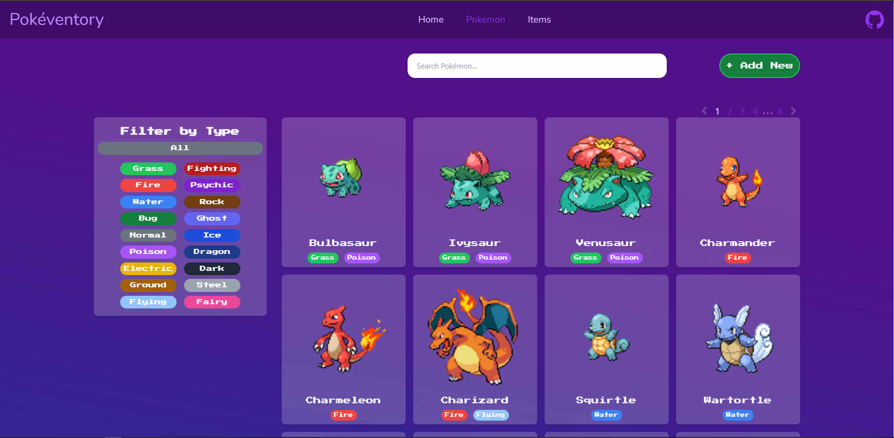

# Pokéventory: Gotta Catalog 'Em All!

Live Demo:
https://pokeventory.onrender.com/

Backend Repository: https://github.com/leo-tsant/pokeventory-api

## Overview

This project was created for the [Inventory Application assignment](https://www.theodinproject.com/lessons/nodejs-inventory-application) as part of [The Odin Project](https://www.theodinproject.com/) curriculum. It features a full stack application with a user-friendly interface, a comprehensive Pokédex, and powerful search and filtering capabilities. Includes all CRUD actions!

## Technologies Used

### Frontend

-   **React**
-   **Vite**
-   **TailwindCSS**
-   **React Router**
-   **PokeAPI**

### Backend

-   **Node.js**
-   **Express**
-   **MongoDB**
-   **Mongoose**
